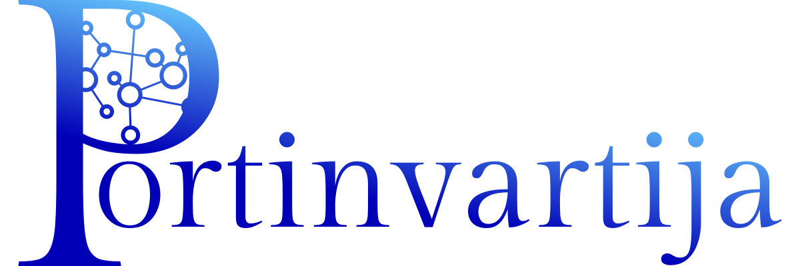

# Portinvartija (PORTI)

Solve the Linux OS' SecureBoot kernel signing drama once & for all.

`Concierge` in Finnish language, Portinvartija is created solely for 1 purpose
and 1 purpose only:

1. **Secure Boot Kernel Module Signing** - utilizing local tool (`openssl`) to
   sign Linux kernel module using a qualified Machine Owner Key ("MOK").
2. **Local MOK Key Management** - manage the local MOK key with encrypted USB
   devices (using `cryptsetup`).
3. **Create and Manage Encrypted MOK Key Storage Devices** - avoid leaving your
   (very complicated) MOK keys in the wild.
4. **Systematically Self-Improvable** - Have this software to be self-improved
   over-time.
5. **The Last Straw - Nvidia drivers** - At the time of creation, SecureBoot on
   Debian is still undergo development and there is no easy way to seamlessly
   supporting locally compiled kernel modules.

## License

The software is licensed under the OSI recognized [Apache 2.0](LICENSE.txt)
license.

## To Contribute

Portinvartija cannot be made successfully without contributions from (Holloway)
Chew, Kean Ho, his teams, and supports from external folks. If you had been
using AutomataCI and wish to contribute back, there are 2 ways to do so:

### Financial

To financially support the project, please head over to Holloway's sponorship
store here:

A small token purchase would helps a lot.

### Craftmanship

If you wish to bring in codes contribution, bug report, and ideas, please feel
free to refer the PDF Handbook and execute accordingly.
